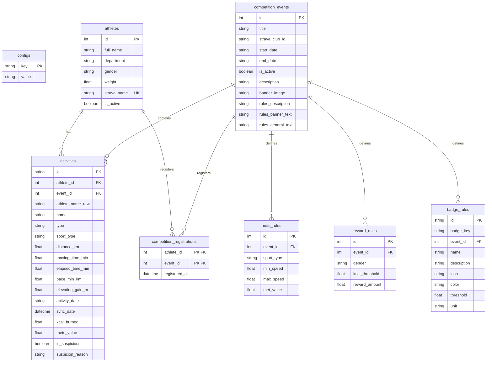

# Bản Đồ Tri Thức Dự Án: SSO_HC

Tài liệu này cung cấp cái nhìn toàn cảnh về hệ thống quản lý và đồng bộ thành tích thể thao nội bộ **SSO HC**. Giúp người đọc/AI tiếp theo nhanh chóng nắm bắt ngữ cảnh (context) trước khi phát triển các tính năng mới.

---

## 1. Tổng Quan Dự Án & Mục Tiêu
Hệ thống **SSO HC** được xây dựng nhằm mục đích:
- Đồng bộ tự động các hoạt động thể thao (Chạy bộ, Đi bộ, Đạp xe, Bơi lội,...) của cán bộ nhân viên công ty từ nhóm Strava chung (**Strava Club**).
- Tính toán năng lượng tiêu thụ động (**KCAL**) dựa trên hệ số **METs** chuẩn và cân nặng của từng vận động viên.
- Xếp hạng thành tích cá nhân, phòng ban theo từng giải đấu cụ thể (**Competition Event**).
- Áp dụng các cơ chế Gamification (Huy chương 3D ảo, Thanh tiến trình tiến tới mốc giải thưởng bằng tiền mặt VND) để tạo động lực thi đua.

---

## 2. Công Nghệ Sử Dụng (Tech Stack)
- **Backend**: Python 3.12+, FastAPI (Web framework), SQLAlchemy (ORM).
- **Database**: SQLite (Tệp tin `TDTT_SSO.db` hoặc cấu hình qua `DATABASE_URL`).
- **Frontend**: HTML5, Vanilla CSS (Glassmorphism UI hiện đại), Vanilla JS (giao tiếp qua AJAX API).
- **Template Engine**: Jinja2 Templates (render từ backend).
- **Thư viện chính**: `pandas` (đọc/xuất Excel), `requests` (giao tiếp API Strava).

---

## 3. Bản Đồ Cơ Sở Dữ Liệu (Database Schema)

### Các quy tắc đặc biệt về dữ liệu:
- **Fallback Cấu Hình**: Các bảng `mets_rules`, `reward_rules` và `badge_rules` chứa cột `event_id` (cho phép `NULL`). Nếu `event_id` là `NULL`, đó là cấu hình mặc định của hệ thống. Khi tính toán cho một giải đấu X, nếu X chưa được cấu hình riêng, hệ thống tự động tìm và sử dụng cấu hình mặc định này.
- **Ràng buộc khóa chính của BadgeRule**: Khóa chính `id` có cấu trúc `f"{badge_key}_{event_id}"` nếu là cấu hình riêng của giải đấu, và là `badge_key` nếu là cấu hình mặc định (ví dụ: `fresh_start_2` cho giải chạy ID=2 và `fresh_start` cho mặc định). Trường `badge_key` lưu giá trị mã gốc để phục vụ logic kiểm tra huy hiệu.

---

## 4. Luồng Dữ Liệu Cốt Lõi (Core Data Flows)

### A. Luồng đồng bộ hoạt động từ Strava:
1. `BackgroundScheduler` gọi hàm đồng bộ định kỳ hoặc Admin kích hoạt đồng bộ thủ công.
2. Hệ thống gọi API Strava Club Activities bằng `Access Token` của tài khoản Admin liên kết.
3. Duyệt qua danh sách hoạt động trả về. Tìm VĐV tương ứng trong bảng `athletes` khớp cột `strava_name` (không phân biệt hoa thường, so khớp tên thô).
4. Nếu tìm thấy VĐV và hoạt động chưa tồn tại trong bảng `activities`, tiến hành phân tích hoạt động:
   - Xác định giải đấu tương ứng (`event_id`) dựa trên ngày diễn ra hoạt động (`activity_date` nằm giữa `start_date` và `end_date` của giải chạy).
   - Kiểm tra gian lận tự động (Pace quá nhanh, ElevationGain phi thực tế dựa trên cấu hình chống gian lận trong `configs`).
   - Tính toán hệ số **METs** động từ `calculations.py`.
   - Quy đổi sang **KCAL** tiêu hao dựa trên METs và cân nặng VĐV.
   - Lưu hoạt động vào bảng `activities`.

### B. Luồng xếp hạng trên Bảng Xếp Hạng (BXH):
- Dữ liệu calo và quãng đường trên BXH của giải đấu X **chỉ tính cho những vận động viên đã đăng ký tham gia giải đấu đó** (có liên kết trong bảng `competition_registrations` đối với `event_id = X`).

---

## 5. Cấu Trúc Thư Mục Dự Án
- `backend/`: Chứa mã nguồn Python xử lý backend.
  - `database.py`: Định nghĩa ORM SQLAlchemy, cấu hình SQLite và di trú dữ liệu tự động.
  - `calculations.py`: Các công thức tính toán lượng Calo (chuẩn ACSM), hệ số METs động, mốc giải thưởng và kiểm tra huy hiệu ảo.
  - `sync_engine.py`: Bộ máy đồng bộ dữ liệu API Strava, liên kết hoạt động, kiểm tra chống gian lận và import dữ liệu Excel lịch sử.
  - `auth.py`: Quản lý phiên đăng nhập Admin bằng Cookie.
  - `main.py`: Điểm khởi chạy FastAPI, định nghĩa các router APIs và HTML endpoints.
- `templates/`: Giao diện HTML Render động qua Jinja2.
  - `index.html`: Bảng xếp hạng chính (Cá nhân, Phòng ban, Sport type, hoạt động nghi ngờ).
  - `profile.html`: Trang cá nhân Gamification của VĐV (huy chương 3D lấp lánh, thanh tiến trình giải thưởng, chuyển đổi giải đấu).
  - `admin.html`: Bảng quản trị hệ thống (Thêm/sửa VĐV, Cấu hình METs/Rewards/Badges theo giải chạy, Quản lý giải đấu).
- `static/`: Chứa CSS, JS tĩnh và hình ảnh thương hiệu (`branding/`).
